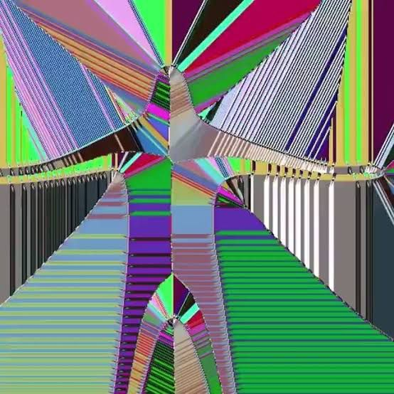
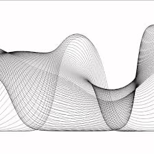

# jsbao571_9103_tut10
My first repository for IDEA9103

This is my first local change to the repo!
## Part 1: Imaging Technique Inspiration
Zach Lieberman's generative line art serves as inspiration as it creates complex, changing images with just basic lines and motion. I want to employ creative coding to make dynamic compositions by including his use of randomisation, repetition, and flowing patterns. This method is advantageous since it can be achieved with JavaScript and p5.js, which makes it perfect for an interactive and visually appealing output that falls within the parameters of the course. It strikes a mix between intricacy and usability, enabling experimentation and yielding visually stunning outcomes.

## Part 2: Coding Technique Exploration
### ***Coding Technique: Perlin Noise in p5.js*** ###

Perlin noise is a coding technique used to generate smooth, natural randomness—ideal for creating flowing, organic line movement in generative art. In p5.js, the noise() function helps control line distortion or shape evolution frame by frame. This technique supports the layered, fluid aesthetics of Zach Lieberman’s work by introducing controlled randomness, making visuals feel alive and dynamic without harsh transitions.
#### Image: ####

Soucre: Stack Overflow

Example Code: Perlin Noise Flow Field-p5.js Web Editor
#### *Link:* ####
[Explore an interactive example here:](https://editor.p5js.org/arthurrc/sketches/Bya9WiAnm)

